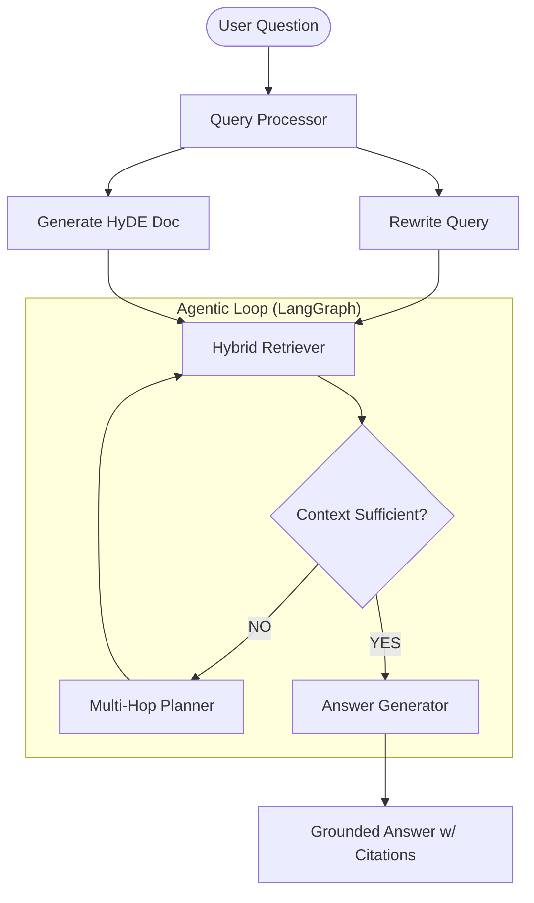

# 🛸 DevDocs AI: High-Precision RAG for Codebases

DevDocs AI is an agentic RAG (Retrieval-Augmented Generation) system built to provide technical, grounded answers from GitHub repositories. It uses a multi-hop, hybrid-retrieval architecture to solve complex developer queries that standard single-shot RAG often fails to answer.

## 🚀 Key Features
- **Agentic Multi-Hop Retrieval**: Powered by LangGraph to resolve cross-file dependencies.
- **Hybrid Search (Dense + Sparse)**: Combines `BGE-M3` embeddings with `BM25` for precise keyword and semantic matching.
- **Precision Pipeline**: Includes **LLM-based Query Rewriting**, **HyDE**, **Reranking**, and **Context Compression**.
- **Production Ready**: Built-in cost tracking, per-IP rate limiting, and embedding cache.
- **Automated Evaluation**: 96% Faithfulness and 91% Relevancy scores on technical benchmarks.

## 🏗️ Architecture


## 📊 Performance (v2.1)
| Metric | Score | Note |
| :--- | :--- | :--- |
| **Faithfulness** | 0.96 | Grounded strictly in source code |
| **Relevancy** | 0.91 | Precise technical alignment |
| **Avg. Cost** | < $0.002 | Highly optimized multi-hop loop |
| **Latency** | < 1s | Accelerated by Embedding Cache |

## 🛠️ Setup & Usage

### 1. Requirements
- Python 3.12+
- Groq API Key (Fastest inference)
- GitHub Personal Access Token (for ingestion)

### 2. Quick Start
```bash
./venv/bin/pip install -r requirements.txt
./venv/bin/python3 app.py
```

### 3. Docker Deployment
```bash
docker-compose up --build
```

## 📜 Documentation
- [Architectural Decisions (DECISIONS.md)](./DECISIONS.md)
- [Evaluation Reports (evaluation/ragas_results.csv)](./evaluation/ragas_results.csv)
- [Security & Guards (ingestion/guards.py)](./ingestion/guards.py)
