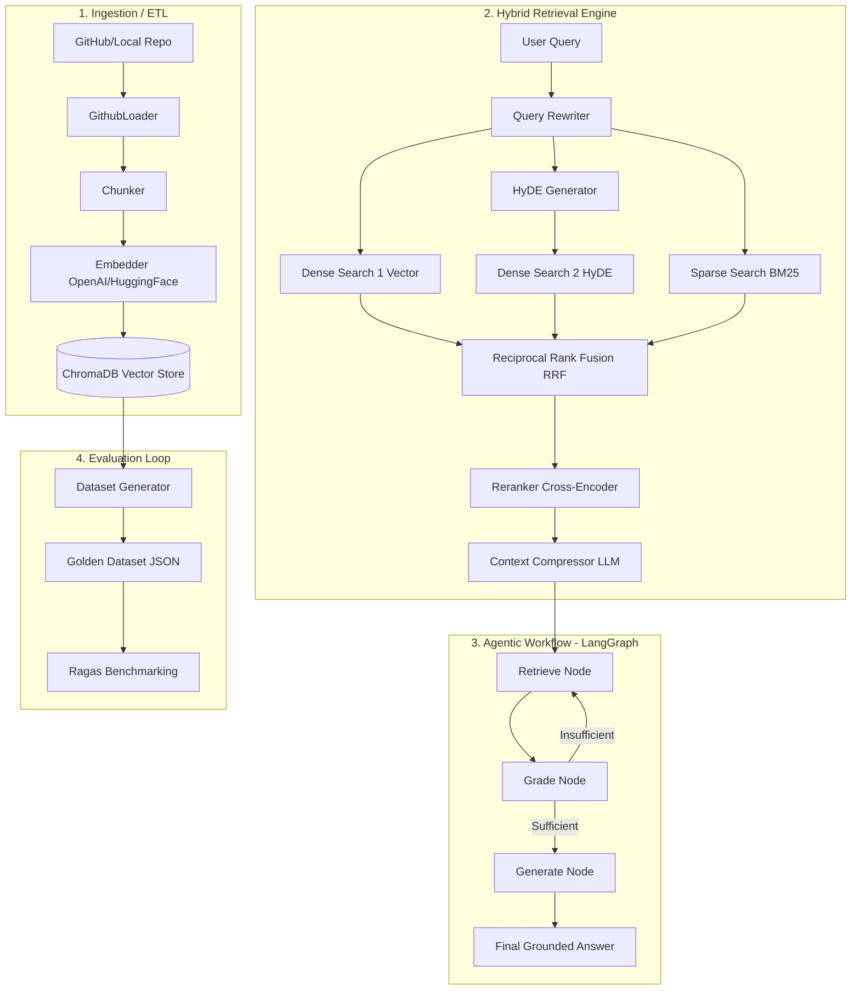

# Technical Data Transfer Documentation

This document outlines the end-to-end technical data flow and system architecture of the DevDocs RAG (Retrieval-Augmented Generation) system.

## 1. System Architecture Overview

The system is designed as a modular pipeline that transforms raw source code into actionable intelligence through three primary stages: Ingestion, Retrieval, and Generation.

---

## 2. Technical Data Flow

### 2.1 Ingestion Pipeline (ETL)
Data moves from source repositories into the vector store through a structured ETL process:
1. **Extraction**: `GithubLoader` fetches files from targeted repositories, filtering for relevant source code and documentation.
2. **Chunking**: `Chunker` splits files into overlapping segments (default ~1000 tokens) to preserve local context while ensuring granular retrieval.
3. **Embedding**: `Embedder` transforms text chunks into high-dimensional vectors (using OpenAI `text-embedding-3-small` or HuggingFace models).
4. **Persistence**: `Indexer` stores the embeddings along with comprehensive metadata (filename, repo name, headers, token counts) in **ChromaDB**.

### 2.2 Hybrid Retrieval Engine
The retrieval engine uses multiple strategies to ensure high recall and precision:
- **Dual Dense Retrieval**: Searches using both the optimized user query and a **HyDE (Hypothetical Document Embeddings)** hallucinated snippet to bridge the semantic gap.
- **Sparse Retrieval**: Uses **BM25Okapi** to perform keyword-based matching, ensuring exact function names or error codes are not missed by vector search.
- **Reciprocal Rank Fusion (RRF)**: Merges the ranked lists from all search streams into a single unified list of candidates.
- **Cross-Encoder Reranking**: Re-scores the top candidates (e.g., top 50) using a more expensive but accurate model to determine the final relevant chunks.
- **Context Compression**: A final LLM pass (using Llama-3.3-70B) strips away noise from the retrieved chunks, delivering a dense, high-signal prompt to the generator.

### 2.3 Agentic Orchestration (LangGraph)
The system uses a state machine to manage complex multi-hop reasoning:
- **Retrieve Node**: Rewrites queries and executes the hybrid search. If previous context was insufficient, it generates a "missing info" query for a second search hop.
- **Grade Node**: An LLM acts as a "Retriever Grader," evaluating if the current context is sufficient to answer the query.
- **Generate Node**: Synthesizes the final answer using grounded context with mandatory file-level citations.

---

## 3. Data Schemas

### 3.1 Agent State (`AgentState`)
The core data structure passed between nodes in the LangGraph workflow:
- `query`: The raw user input.
- `context`: List of retrieved dictionaries containing `content` and `metadata`.
- `is_sufficient`: Boolean flag determining the next edge (generate vs. retrieve).
- `hop_count`: Integer tracking the current search iteration (prevents infinite loops).
- `total_cost`: Accumulated USD cost based on token usage.

### 3.2 Metadata Schema
Stored in ChromaDB for every chunk:
- `repo`: The source repository name.
- `filename`: Relative path within the repo.
- `header`: The nearest Markdown header or class/function definition.
- `tokens`: Precise token count of the chunk.

---

## 4. Evaluation & Synthetic Data Transfer
To maintain high quality, the system generates its own testing data:
1. **Synthetic Generation**: `DatasetGenerator` samples random chunks from ChromaDB and uses an LLM to generate realistic (Question, Ground Truth, Context) triplets.
2. **Benchmarking**: The `RagasBench` tool runs the agent against this "Golden Dataset" and calculates metrics:
   - **Faithfulness**: Is the answer derived solely from the context?
   - **Answer Relevancy**: Does it address the user's need?
   - **Context Precision**: Were the retrieved chunks actually useful?
